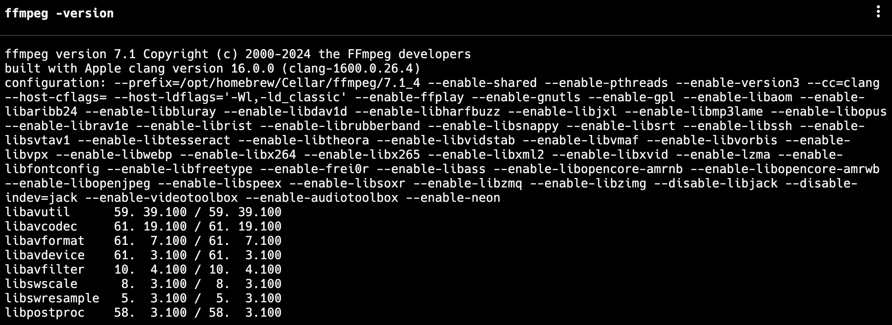
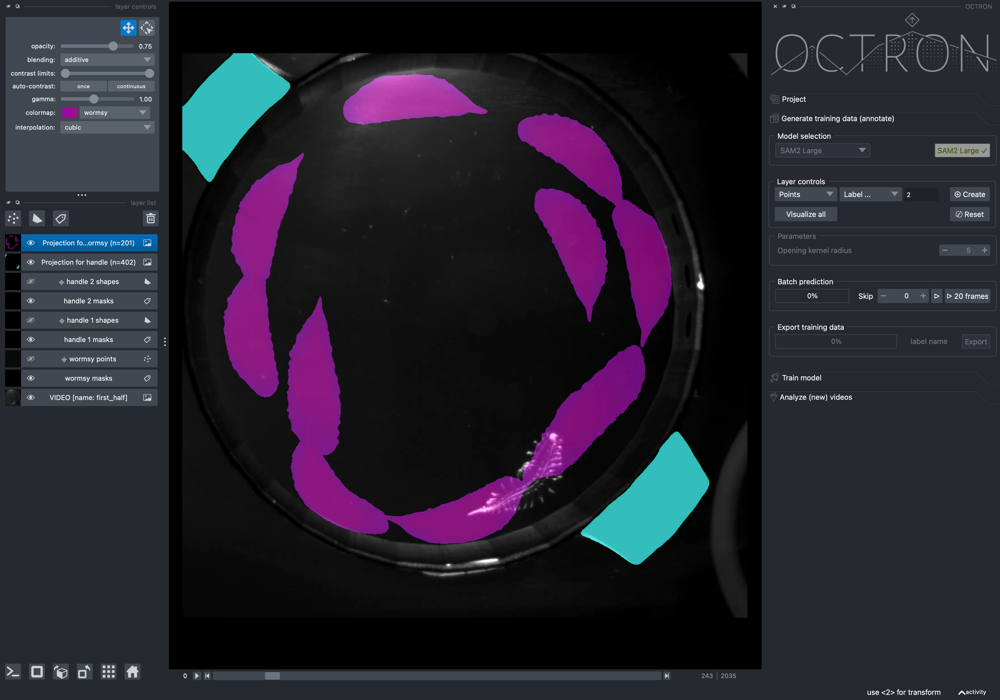

# OCTRON

OCTRON is a [napari](https://www.napari.org) plugin that allows for tracking animals in behavioral setups. It helps you to create rich annotation and training data that can be used to train your own machine learning tracker.
This enables dense quantification of animal behavior across a wide range of species and video recording conditions. 

## Installation

> :warning: **This repo is undergoing a lot of changes**: <br>
    Just a heads up that there will be changes accumulating in the repo over these days. So the first thing that you should do before playing with OCTRON (after you installed it successfully once, see below), should be:<br>
    1. Pull latest changes from main (in the github desktop app for example)<br>
    2. In your terminal, browse to your cloned repository folder on disk and ...<br>
    3. `pip install . -U` for installing the new code<br><br>
    If you ever mess up completely, do not despair! You can trash everything with<br>`conda deactivate && conda env remove --name octron --yes`.<br>Then you have to start with the conda *.yml* again (see steps explained below). 


Follow these steps: 

1. Make sure ffmpeg is installed on the system. Some packages rely on it.
    
    - If this output fails for some reason, make sure you install ffmpeg first:
        - [step by step guide for windows](ffmpeg_windows.md)
        - on MacOS you can use [homebrew](https://formulae.brew.sh/formula/ffmpeg) and `brew install ffmpeg`
        - Linux users: You know what to do

2. Download miniconda. Open your web browser and go to the official Miniconda download page: [Miniconda Download](https://docs.conda.io/en/latest/miniconda.html). Download and execute the installer for your operating system (Windows, macOS, or Linux). Then restart your terminal.

3. Clone this repository and in a terminal (CMD on Windows) browse to the folder that you cloned it to (`cd "YOUR/CLONED/FOLDER"`)

4. Create a new Conda environment called "octron" with Python version 3.11:
    ```sh
    conda env create -f environment.yaml
    ```
    > :warning: **If you have a CUDA compatible graphics card in your computer (NVIDIA card), do instead**:<br>
        ```sh
        conda env create -f environment_cuda.yaml
        ```
    <br>This will download CUDA packages matching the requested pytorch version automatically on windows and linux systems.
5. Activate the new environment:
    ```sh
    conda activate octron
    ```
6. Check the accessibility of GPU resources on your computer:
    ```sh
    python test_gpu.py
    ```
    This should show your graphics card, if it is correctly installed and accessible by pytorch. If this fails, you should correct this first, since OCTRON will not engage your GPU otherwise (and that is much slower).

## Usage
1. Activate the new environment:
    ```sh
    conda activate octron
    ```
2. ```sh
    octron-gui
    ```
    ... and enjoy! 
    On first start this will literally take forever to load, since also the SAM2 models are all downloaded once. But subsequent startups will be much quicker. 

More instructions to follow ... stay tuned! 



---

### Attributions
- Interface button and icon images were created by user [Arkinasi](https://thenounproject.com/browse/collection-icon/marketing-agency-239829/) from Noun Project (CC BY 3.0)
